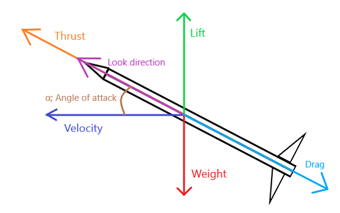

Physics settings are now passed as a third parameter of `HomingCast.SpawnProjectile`/`HomingCast.CreateProjectile` methods as a table structure

## Physics properties allow you to simulate realisitic physics

!!! question "How does this physics work?"
    This physics is based on missile's physics

    { width="450", height="150" }

!!! danger "Beware!"
    If you use physics, do not set physics properties to extremely high values as it can lead to jittering

    **Everything must be balanced**

---
Each setting is marked with

- `r` for direct read permission
- `w` for direct write permission

---

## Here's all properties

---

### Mass [rw] (number)
Mass of the projectile

**errors** if omitted

!!! info "Remember"
    Gravity value must be always **negative** when passed

---

### Gravity [rw] (number)
Gravity of the projectile

Default value is `-9.81` if omitted

---

### LiftPower [rw] (number)
This is a constant for the lift coefficient. Determines aerodynamic capabilities of the projectile for pitch

**errors** if omitted

---

### YawPower [rw] (number)
This is a constant for the yaw coefficient. Determines aerodynamic capabilities of the projectile for yaw

**errors** if omitted

---

### DragCoefficient [rw] (number)
Determines the resistance of the projectile in a fluid environment

**errors** if omitted

---

### InducedDragYaw [rw] (number)
Determines the resistance of the projectile in a fluid environment when rotating on the yaw axis

**errors** if omitted

---

### InducedDragPitch [rw] (number)
Determines the resistance of the projectile in a fluid environment when rotating on the pitch axis

**errors** if omitted

---

### ThrustPower [rw] (number)
Sets the force which constantly pushes the projectile in its look direction

**errors** if omitted

---

### PitchAoA [rw] ({Value: number, AoA: number})
This is a list which determines the lift coefficient at some angle of attack

**errors** if omitted

!!! example "Example"
    ```lua
    PhysicsProperties.PitchAoA = {
        {["Value"] = -0.12,["AoA"] = -65},
        {["Value"] = -1,["AoA"] = -25},
        {["Value"] = 0,["AoA"] = 0},
        {["Value"] = 1,["AoA"] = 25},
        {["Value"] = 0.12,["AoA"] = 65}
    }
    ```

!!! danger "Recommendations"
    ```Value``` should be from [**-1** to **1**].
    But you can set to any value you want

!!! question "How do I get this table?"
    Use my [plugin](https://create.roblox.com/store/asset/97281486618608/HomingCast-Plugin) for this and change the mode to ```AoA```

    Read about it [here](CustomTrajectories.md)

---

### YawAoA [rw] ({Value: number, AoA: number})
This is a list which determines the yaw coefficient at some angle of attack yaw

**errors** if omitted

!!! example "Example"
    ```lua
    PhysicsProperties.YawAoA = {
        {["Value"] = -0.12,["AoA"] = -65},
        {["Value"] = -1,["AoA"] = -25},
        {["Value"] = 0,["AoA"] = 0},
        {["Value"] = 1,["AoA"] = 25},
        {["Value"] = 0.12,["AoA"] = 65}
    }
    ```

!!! danger "Recommendations"
    ```Value``` should be from [**-1** to **1**].
    But you can set to any value you want

!!! question "How do I get this table?"
    Use my [plugin](https://create.roblox.com/store/asset/97281486618608/HomingCast-Plugin) for this and change the mode to ```AoA```

    Read about it [here](CustomTrajectories.md)

---

!!! info "Remember"
    The ```Value``` will be smoothed from one to another value based on given angle of attack (pitch / yaw)
      
---

### G_Limit [rw] (number)
G limit of the projectile

**errors** if omitted

---

### Direction [rw] (Vector3)
Determines at what direction the projectile is rotated after launch

**errors** if omitted

---

### AdditionalForces [rw] (Vector3)
Additional force which will effect on the cast constantly

Default value is `Vector3.zero` if omitted